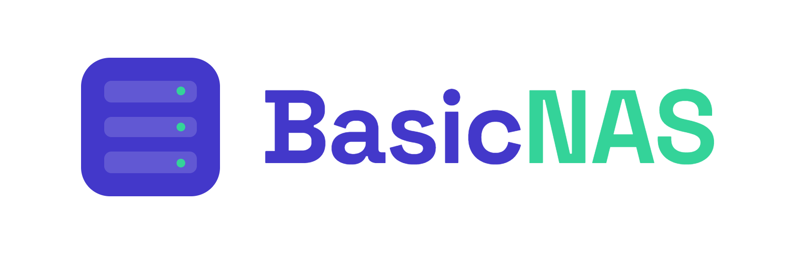

<div align="center">



**A simple, clean NAS. Written from scratch in Go.**

[**basicnas.io**](https://basicnas.io)

[](https://github.com/ValentinDoche/BasicNAS/stargazers)
[](https://github.com/ValentinDoche/BasicNAS/releases)
[](https://github.com/ValentinDoche/BasicNAS/actions)
[](https://github.com/ValentinDoche/BasicNAS/releases/latest)
[](LICENSE)

</div>

---

## About

I was looking for a NAS solution that was simple to install, simple to use, and that
did not drag in a whole operating system, a plugin store and three layers of web UI to
share a folder. I did not find one I liked.

So I wrote my own.

**BasicNAS** is a self-contained NAS server written from scratch in Go — no Samba
daemon, no third-party file server behind the scenes. It speaks SMB natively, exposes
a small REST API, and ships a clean web interface to manage shares, users and disks.

Nothing more than what a NAS actually needs.

## Modules

| Module     | Role                                                       |
| ---------- | ---------------------------------------------------------- |
| `samba`    | SMB server implementation — the core of the file sharing   |
| `disk`     | Disk detection, mounting, pools and health                 |
| `database` | Persistence layer for users, shares and configuration      |
| `api`      | REST API consumed by the web interface                     |
| `web`      | Web interface (Svelte)                                     |
| `docs`     | Documentation — published on [basicnas.io](https://basicnas.io) |

## Requirements

- **Debian 13** (Trixie)
- **2 disks** — one for the system, one (or more) for the data
- Port **445/tcp** available on the host

---

## Installation

### Production

**1. Create a dedicated system user**

```bash
sudo useradd --system --home-dir /opt/BasicNAS --shell /usr/sbin/nologin BasicNAS
```

**2. Download the application into `/opt/BasicNAS`**

```bash
sudo mkdir -p /opt/BasicNAS
# download the latest release binary into /opt/BasicNAS/basicnas
```

**3. Set ownership and permissions**

```bash
sudo chown -R BasicNAS:BasicNAS /opt/BasicNAS
sudo chmod 750 /opt/BasicNAS
sudo chmod 750 /opt/BasicNAS/basicnas
```

**4. Install the systemd service**

```bash
sudo cp /opt/BasicNAS/basicnas.service /etc/systemd/system/
sudo systemctl daemon-reload
sudo systemctl enable --now basicnas
```

BasicNAS listens on port **445**, which is a privileged port, while the service runs as
an unprivileged user. The unit grants the capability to bind it:

```ini
[Service]
User=BasicNAS
AmbientCapabilities=CAP_NET_BIND_SERVICE
CapabilityBoundingSet=CAP_NET_BIND_SERVICE
```

**5. Check that it is running**

```bash
systemctl status basicnas
journalctl -u basicnas -f
```

### Development

**Requirements:** WSL2 (Debian) or any Unix environment, and Go 1.26+.

Running as a normal user, you cannot bind port 445 without help. Lower the privileged
port threshold on your development machine (WSL2 or VM):

```bash
echo 'net.ipv4.ip_unprivileged_port_start=0' | sudo tee /etc/sysctl.d/99-unprivileged-ports.conf
sudo sysctl --system
```

Then clone and build:

```bash
git clone https://github.com/ValentinDoche/BasicNAS.git
cd BasicNAS
go build ./...
```

---

## License

BasicNAS is released under the **GNU General Public License v3.0**.
See [LICENSE](LICENSE) for the full text.

---

<div align="center">

Made with love and some coffee in France 🇫🇷

</div>
